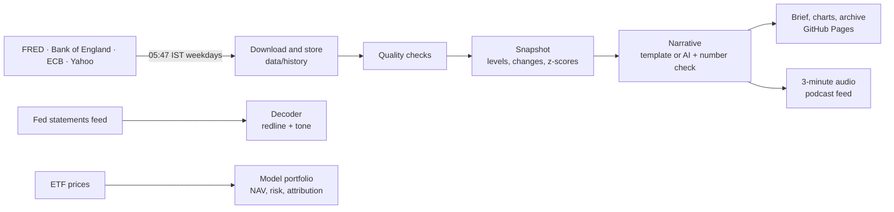

# Macro Quant Lab

A daily, public-data read of rates, credit, equities and FX, a central-bank decoder, and a paper-traded multi-asset model portfolio. Built in Python and run on GitHub Actions; AI drafts and challenges, and a check stops it from stating any number that is not in the data.

## Today's brief

<!-- BRIEF:START -->
**Fri 09 Oct 2026 · Euro AAA 2s10s curve rose 8 bp to 54 bp, about 3.6x a normal day's move**

- Euro AAA 2y fell 6 bp to 3.00%.
- Hang Seng gained 1.59% to 24,163.
- Copper gained 2.00% to 6.6495.
- US 2s10s curve rose 3 bp to 51 bp.
- Nasdaq 100 lost 1.39% to 30,726.

**India**

- Nifty 50 gained 1.17% to 22,491.
- Sensex gained 1.19% to 72,448.
- Nifty Bank gained 1.06% to 55,092.
- India VIX lost 0.57 to 14.71.

[Full brief, charts and table →](https://oblivion783.github.io/macro-quant-lab/) · [Archive](https://oblivion783.github.io/macro-quant-lab/brief/)
<!-- BRIEF:END -->

## What's inside

| Project | Question it answers | Status |
|---|---|---|
| **1 · Daily Macro Desk** | What moved overnight, how unusual was it, and what is priced? | Pipeline built; going live Nov–Dec 2026 |
| **2 · Central Bank Decoder** | When a central bank changes its words, how do markets react? | Redline and tone score built; evaluation Jan–Mar 2027 |
| **3 · Model Portfolio Lab** | Can a documented process beat a 60/40 after costs, and can every decision be explained? | Engine built; live 1 Jan 2027 |
| **4 · Rates Scenario and RV Workbook** | Where are carry, roll and curve value across Treasuries, gilts, Bunds and G-secs? | Planned Jun–Aug 2027 |
| **5 · India Debt Pulse** | How are Indian debt funds positioned as RBI policy and index flows reshape the curve? | Optional, Aug–Sep 2027 |

## How it runs



Everything is free: public data, GitHub Actions, GitHub Pages, and an optional free Gemini API key for the AI draft.

## Run it yourself

Windows step-by-step: **[SETUP_WINDOWS.md](SETUP_WINDOWS.md)**. The short version:

```bash
python -m venv .venv && source .venv/bin/activate      # Windows: .venv\Scripts\Activate.ps1
pip install -r requirements.txt
python -m unittest discover -s tests -t .              # 40+ tests, no network needed
python scripts/run_daily.py                            # download, check, snapshot
python scripts/run_daily.py --offline --publish        # rebuild pages from stored data
python -m mql.store --duckdb                           # SQL over the history (DuckDB)
python -m mql.decoder --bank boe --url <statement> --date YYYY-MM-DD
python -m mql.portfolio --update-prices --backtest 2019-01-01
streamlit run app/streamlit_app.py                     # interactive dashboard
```

## Data

| Source | What | Notes |
|---|---|---|
| [FRED](https://fred.stlouisfed.org) | US Treasury yields, TIPS, breakevens, SOFR, ICE BofA credit spreads, India 10y (monthly) | CSV endpoint, no key |
| [Bank of England](https://www.bankofengland.co.uk/boeapps/database/) | Gilt nominal, real and implied-inflation zero-coupon curves, SONIA | IADB CSV export |
| [ECB Data Portal](https://data.ecb.europa.eu) | Euro AAA government curve, €STR | SDMX REST |
| Yahoo Finance | Equity indices, VIX, MOVE, FX, commodities, ETF prices | Chart API, yfinance fallback |
| Central banks | Policy statements (Fed feed; others by hand) | Linked to source; only changed sentences quoted |

The watchlist lives in [config/series.yaml](config/series.yaml). A quality report (`data/latest/quality.json`) flags any series that fails, goes stale or jumps implausibly.

## AI, with guard rails

- AI drafts the morning narrative from the day's table. **Every number it writes is checked against the table; if one is not there, the AI draft is thrown away and the template is used.**
- The decoder's tone score is evaluated against my own labels of past statements; the agreement rate is published here once the labels exist.
- In the model portfolio, AI argues the other side before a rebalance. It never makes the decision.

## Repository map

```
config/       watchlist, decoder lexicon, portfolio policy, compliance rules
mql/          the package: sources, store, quality, monitor, charts, narrative, decoder, portfolio, podcast
scripts/      run_daily.py
data/         history (CSV), latest snapshot and quality report, statements, portfolio
docs/         the public site (MkDocs): brief, monitor, archive, decoder, portfolio, notes, modules
app/          Streamlit dashboard
tests/        unit tests (no network)
.github/      CI, daily and monthly workflows
```

## Disclaimer

Personal research on public data. Not investment advice, not an offer or solicitation, and no real money in the model portfolio. Views are my own and not those of any employer. Data can be wrong or late; check the source before relying on it.
