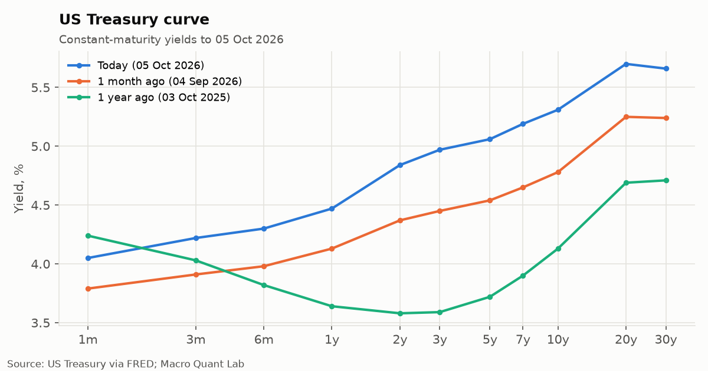
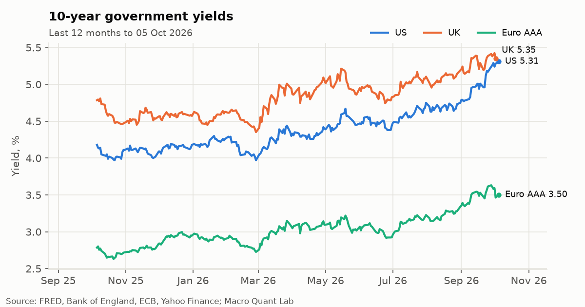
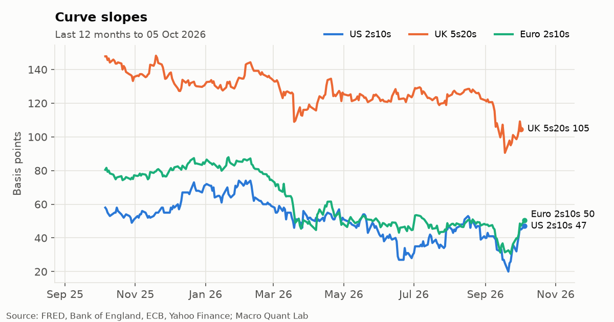
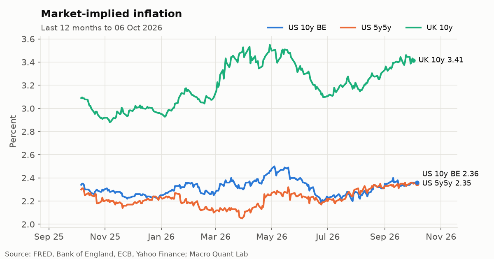
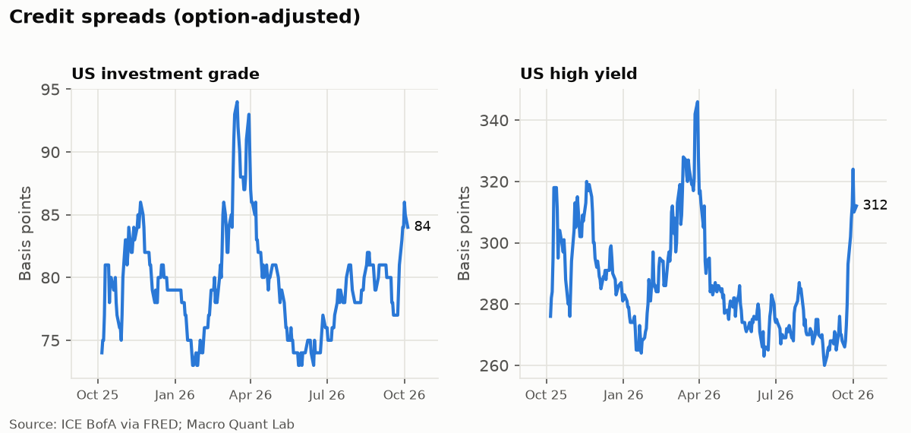
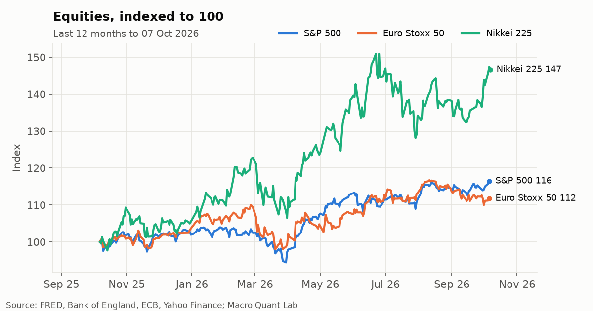
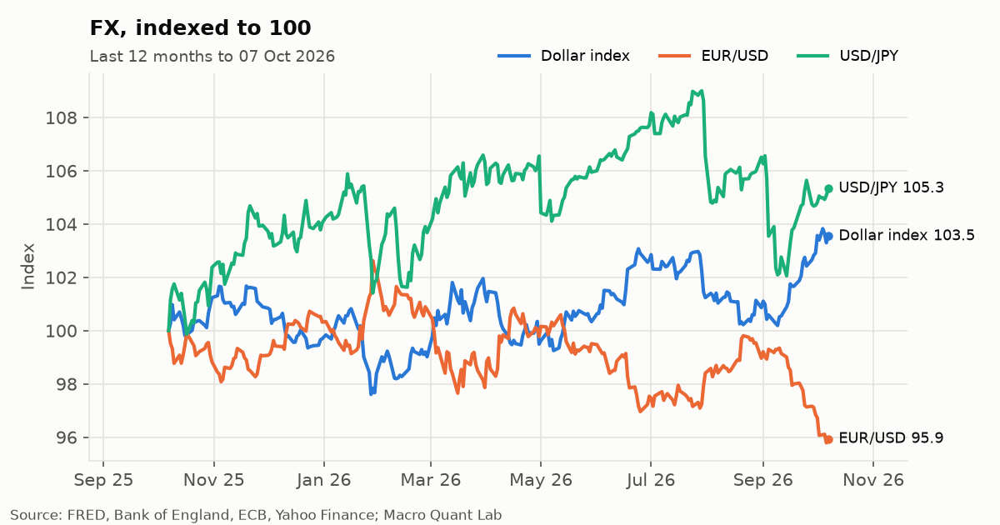
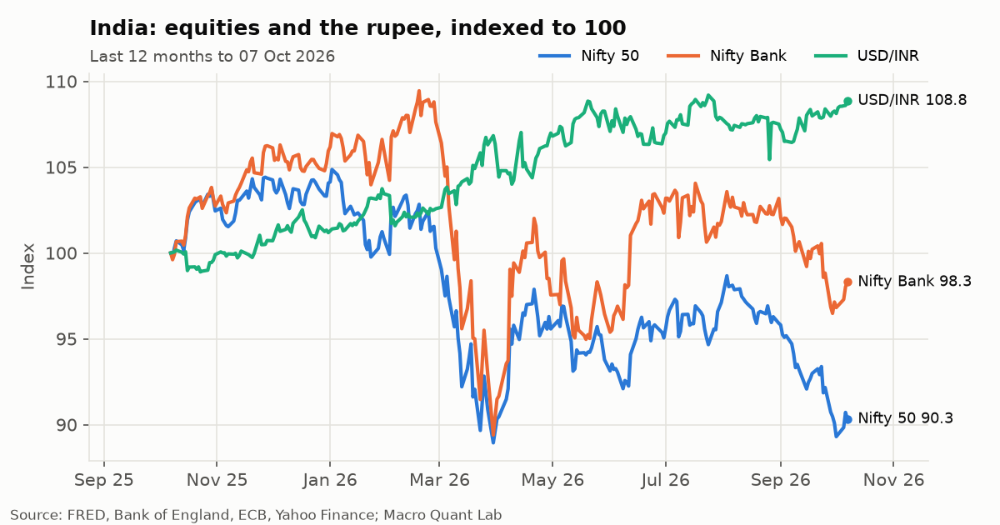

# Monitor

Charts updated 07 Oct 2026. All data free and public; see the [watchlist](https://github.com/Oblivion783/macro-quant-lab/blob/main/config/series.yaml).

## US Treasury curve

## 10-year yields

## Curve slopes

## Market-implied inflation

## Credit spreads

## Equities

## FX

## India

*Personal research on public data. Not investment advice. Views are my own and not those of any employer. Numbers can be wrong; check the source before relying on them.*
